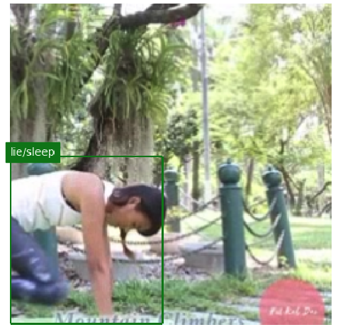
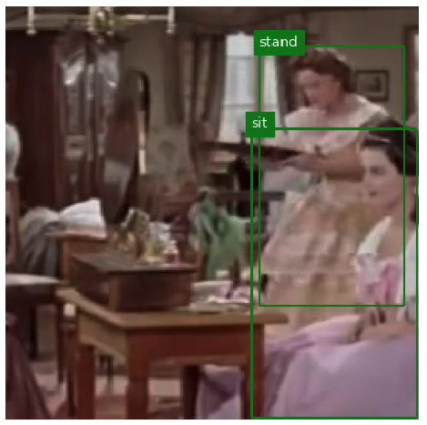
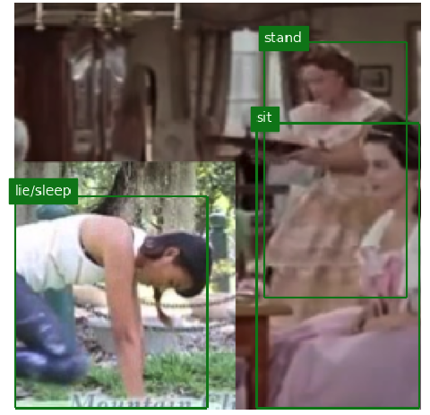
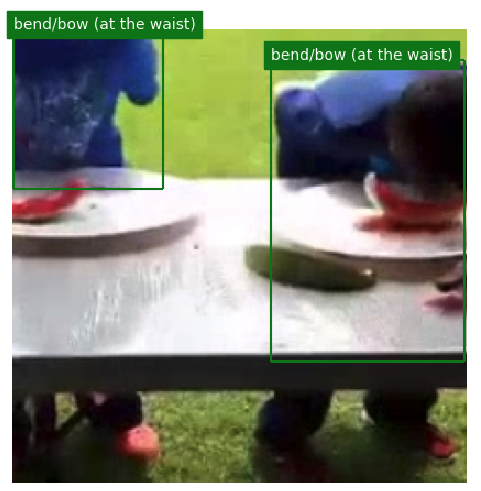
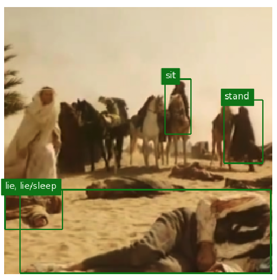
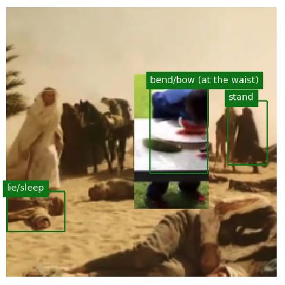
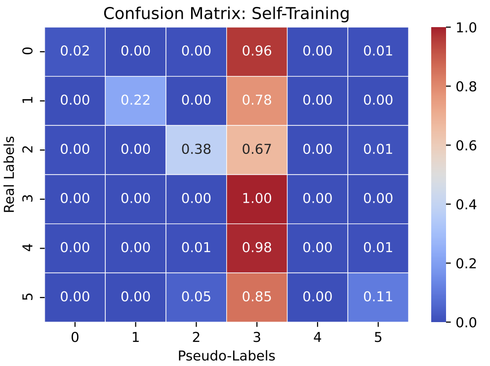
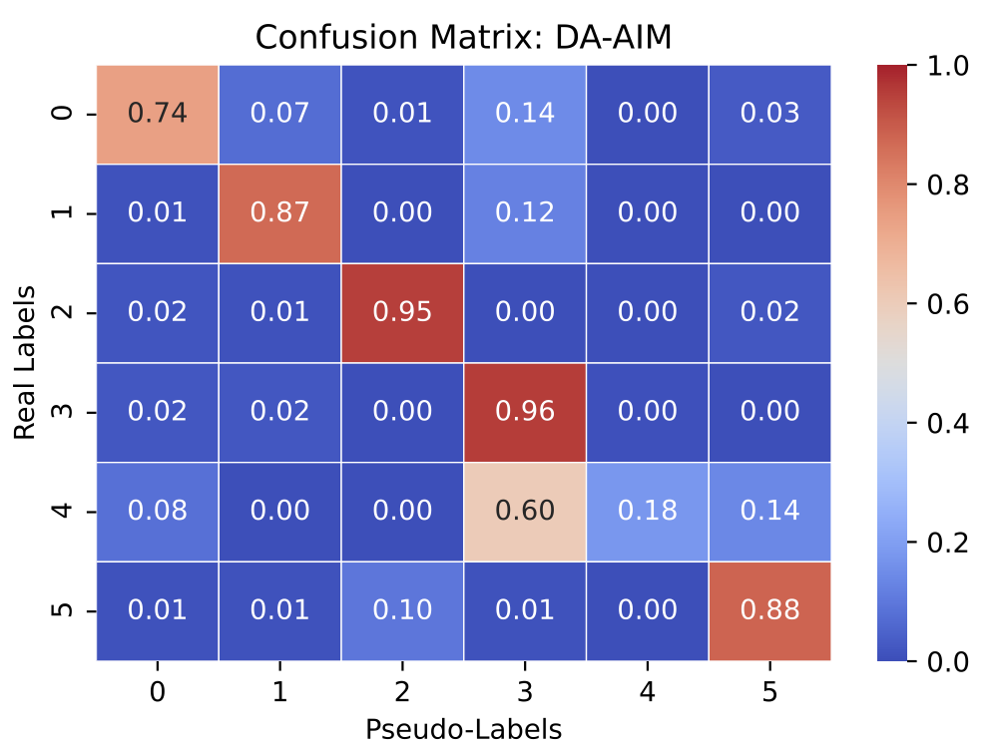

# Additional Visualization Tools for DA-AIM

#### Source Domain, Target Domain and Mixed Samples

<div align=center>
<table style="width:100%">
  <tr>
    <th>Source</th>
    <th>Target</th>
    <th>DA-AIM Mixed</th>
  </tr>
  <tr>
    <td></td>
    <td></td>
    <td></td>
  </tr>
  <tr>
    <td></td>
    <td></td>
    <td></td>
  </tr>
  </table>
  </div>

To enable visulization of mixed samples, add following block in yaml configuration files:

```
TENSORBOARD:
  DAAIM:
    PLOT_REAL_SAMPLES: True
```

#### Confusion Matrix

Example: confusion matrices from **AVA-KIN → AVA** experiments
<div align=center>
<table style="width:100%">
  <tr>
    <th>Mean Teacher</th>
    <th>DA-AIM</th>
  </tr>
  <tr>
    <td></td>
    <td></td>
  </tr>
  </table>
  </div>

To visualize confusion matrices, use following setting in configuration yaml files:

```
TENSORBOARD:
  DAAIM:
    PSEUDOLABELS_CONFUSION_MATRIX: True
```